# SQL Practice

## Summrization
Relational databases are a powerful and flexible way to store, manage, and analyze large amounts of structured data,also they use SQL (Structured Query Language), With SQL we can perform a wide range of operations on the data, like reading, sorting, filtering, and joining tables together.

## Compleated Tasks

### Task 1
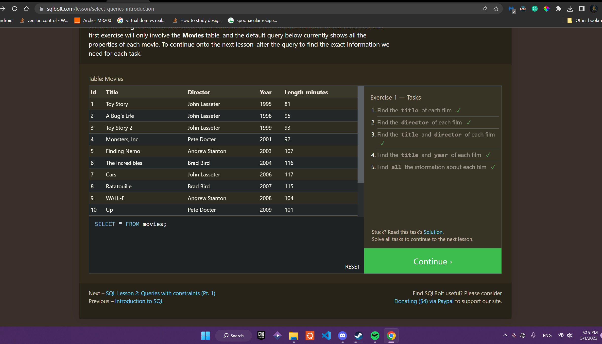
### Task 2
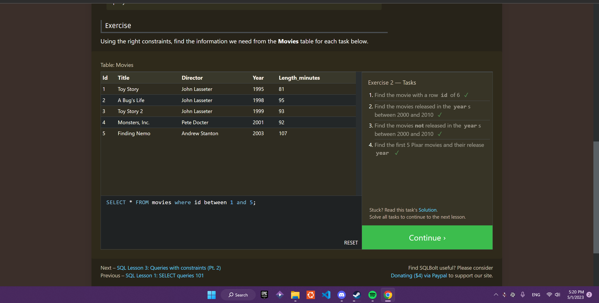
### Task 3
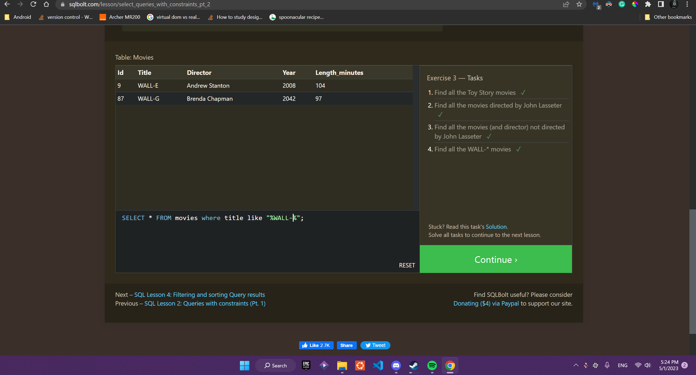
### Task 4
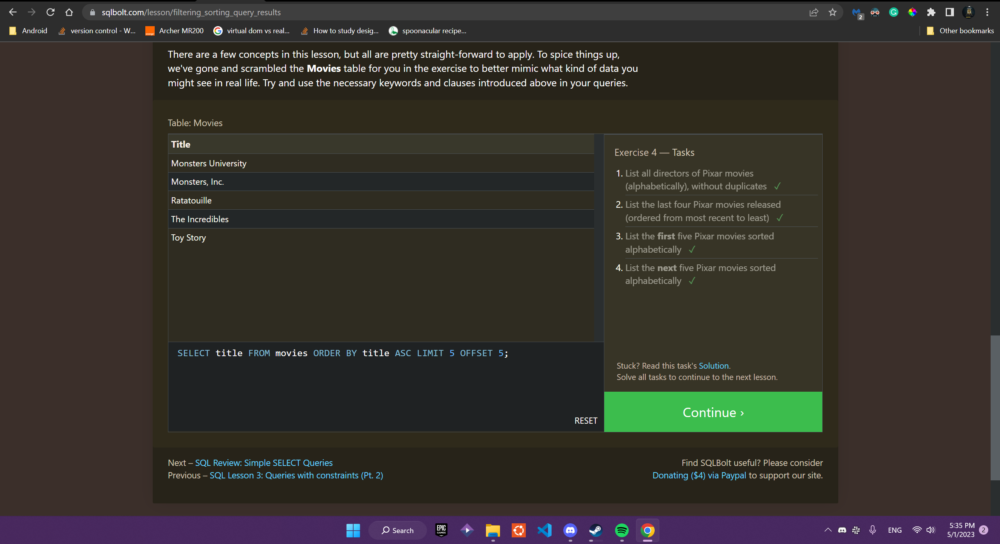
### Task 5
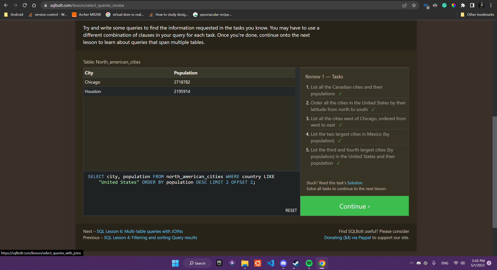
### Task 6
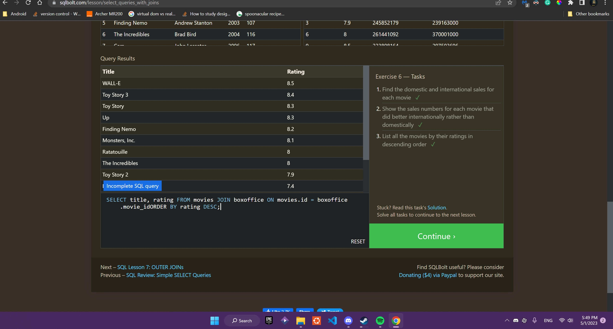
### Task 13
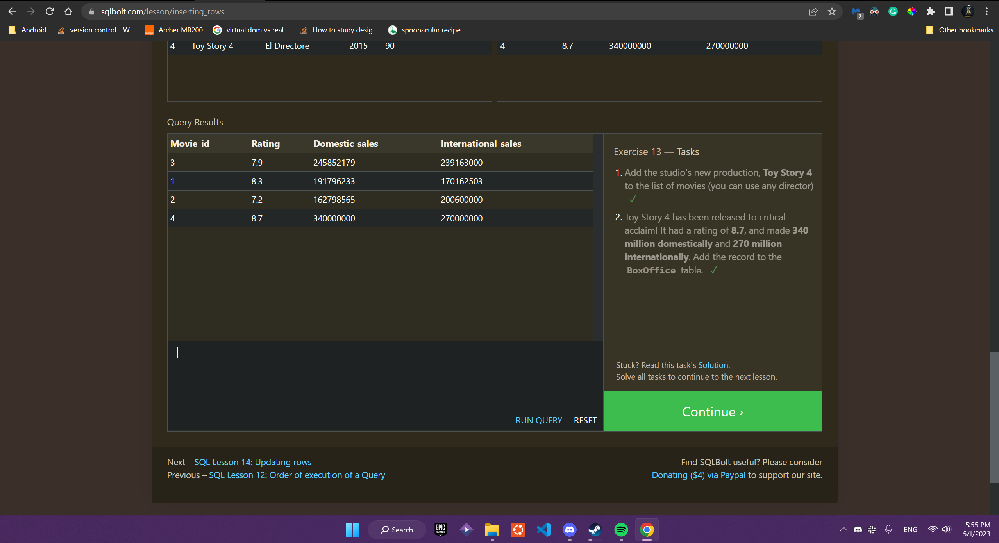
### Task 14
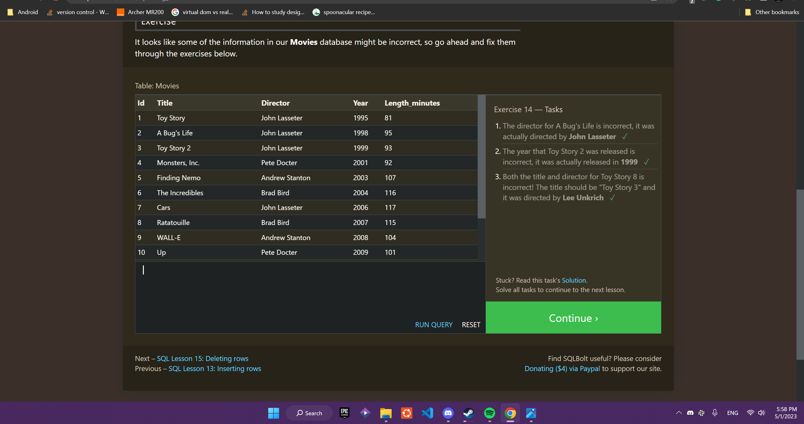
### Task 15
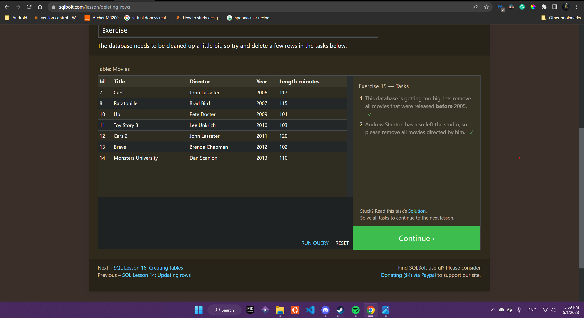
### Task 16
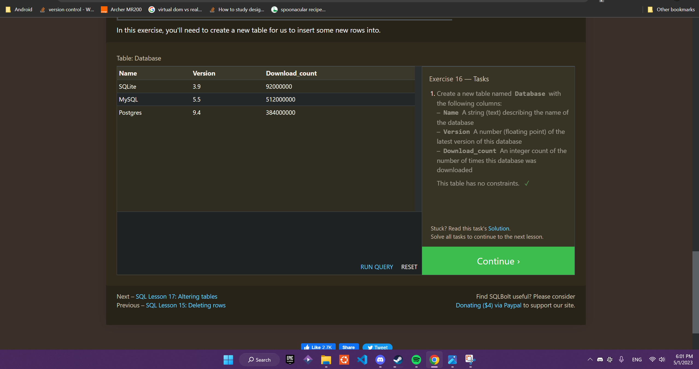
### Task 17
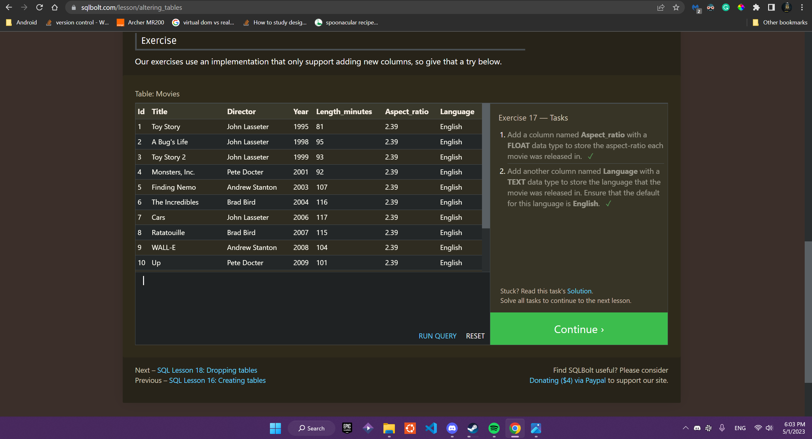
### Task 18
